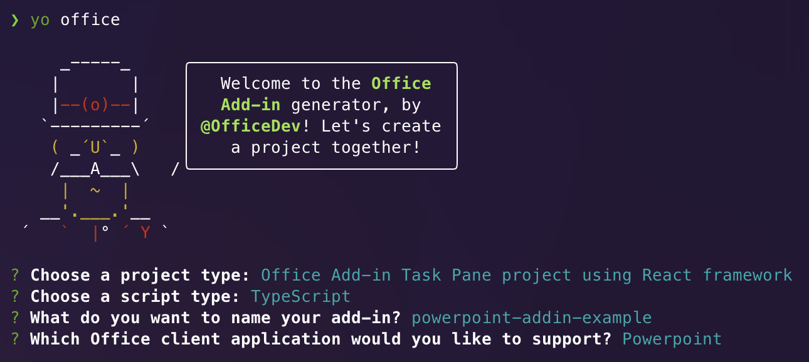
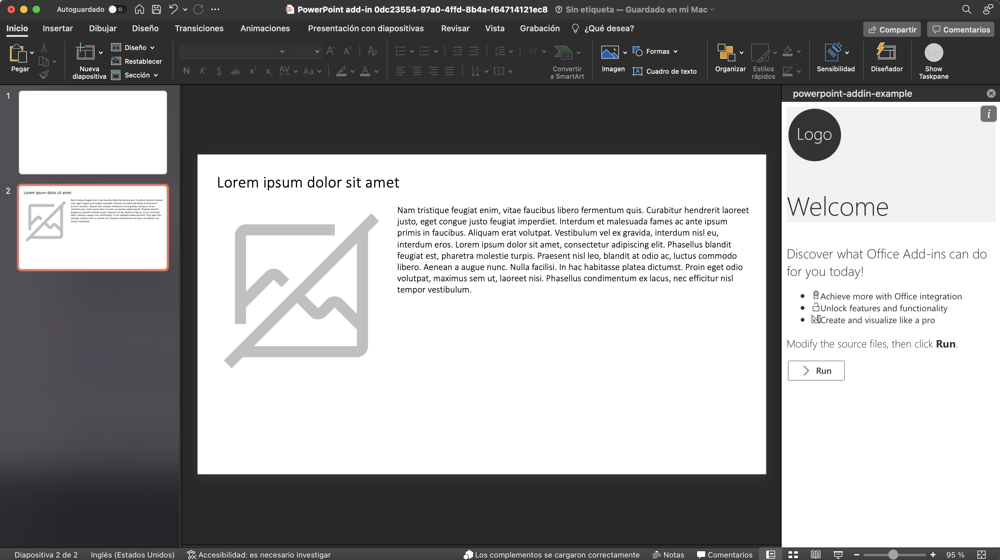
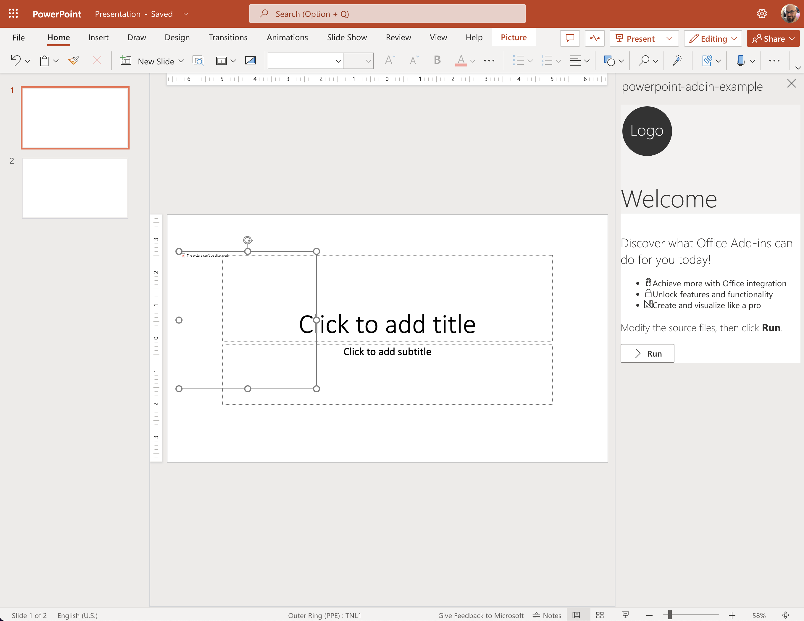
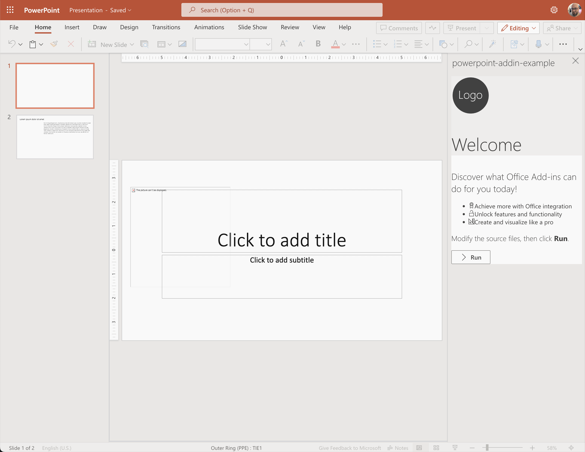

# PowerPoint Online Issue Add-In Example

This examples illustrates an issue executing a task pane add-in in PowerPoint Online. The add-in creates a new slide with three shapes: a text box with a title, a text box with a description, and a picture. The add-in works as expected in PowerPoint desktop, but in PowerPoint Online the add-in fails to render the same result.

## Example Project Creation

The example project was created following the instructions at [Build your first PowerPoint task pane add-in](https://learn.microsoft.com/office/dev/add-ins/quickstarts/powerpoint-quickstart?tabs=yeomangenerator) with the following toolset:

| Tool | Version |
|--|--|
| Node.js | v16.17.1 |
| npm | 8.15.0 |

The project was created as a *Office Add-in Task Pane using react framework* and was entirely generated by the Yeoman generator using the following options:



## Reproducing the Issue

When running the add-in in PowerPoint desktop, it creates a new slide which looks like this:



After adding the slide and its content, the newly created slide is selected.

When running the same add-in in PowerPoint Online, the slide is created, but the image is placed in the first slide and the text boxes are not rendered at all:



Also, the following error is captured in the console:

```text
RichApi.Error: InvalidParam passed to GetItem(id)
    at new n (powerpoint-web-16.00.js:26:304803)
    at r.processRequestExecutorResponseMessage (powerpoint-web-16.00.js:26:369137)
    at powerpoint-web-16.00.js:26:367199
```

The error can be prevented by waiting some time after adding the new slide and before adding the shapes to the slide. In this case the text is correctly rendered, but the image is still placed in the first slide:



It seems like there is a synchronization problem between the add-in JavaScript SDK and PowerPoint Online, where the await in `src/taskpane/components/App.tsx, line 54` is returning the control **before** the slide is actually created. A similar problem occurs with the image placement. In this case, it seems like the callback function at line `src/taskpane/components/App.tsx, line 102` is executed before the slide is actually selected.
